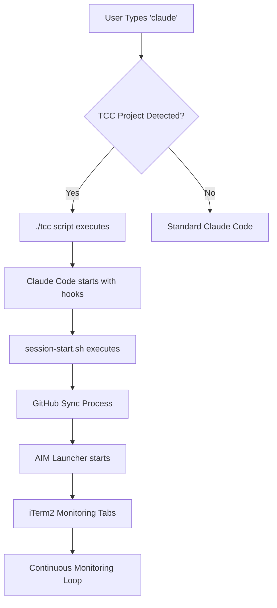

# AI Collaboration Management Framework - Startup Process Diagram

This document provides a comprehensive visualization of how the AICM framework initializes and operates.

## High-Level Startup Flow



## Detailed Startup Sequence

### Phase 1: Initial Setup & Installation

```
┌─────────────────────────────────────────────────────────────┐
│                    INSTALLATION PHASE                       │
└─────────────────────────────────────────────────────────────┘


### Phase 2: Claude Session Initialization

```
┌─────────────────────────────────────────────────────────────┐
│               SESSION START HOOK EXECUTION                  │
└─────────────────────────────────────────────────────────────┘

.claude/hooks/session-start.sh
│
├── 1. GITHUB SYNC
│   ├── git fetch origin main
│   ├── Compare local vs remote HEAD
│   ├── Pull if behind
│   └── Display sync status box
│
├── 2. PENDING BRANCH DETECTION
│   ├── Check /tmp/branch-watcher-{repo}.pending
│   ├── Count OCC branches waiting
│   └── Display TCC alert if branches found
│
├── 3. AIM LAUNCHER STARTUP
│   ├── Check if AIM already running
│   ├── Launch iTerm2 with monitoring tabs
│   └── Store PID for tracking
│
├── 4. CONTEXT DISPLAY
│   ├── Repository name confirmation
│   ├── Current branch identification
│   ├── Role reminder (OCC vs TCC)
│   └── Critical rules from CLAUDE.md
│
└── 5. BOARD STATUS
    ├── Read docs/BOARD.md
    ├── Display current tasks
    ├── Show completion directive
    └── Set TCC expectations
```

### Phase 3: AIM (AI Management) Launcher

```
┌─────────────────────────────────────────────────────────────┐
│                    AIM LAUNCHER SYSTEM                      │
└─────────────────────────────────────────────────────────────┘

scripts/aim-launcher.sh
│
├── PROJECT DETECTION
│   ├── Validate project path
│   ├── Check for Swift/Xcode files
│   ├── Verify scripts directory exists
│   └── Determine monitoring strategy
│
├── ITERM2 INTEGRATION
│   ├── Check iTerm2 availability
│   ├── Create AppleScript for tabs
│   ├── Preserve focus to Claude terminal
│   └── Configure tab names and commands
│
└── LAUNCH 3 MONITORING TABS
    │
    ├── TAB 1: 🔨 BUILD WATCHER
    │   ├── Script: watch-build.sh
    │   ├── Monitors: Swift/Xcode builds
    │   ├── Audio: Basso (error) / Blow (success)
    │   └── Only active for Swift projects
    │
    ├── TAB 2: 🌿 OCC BRANCH WATCHER
    │   ├── Script: watch-branches.sh
    │   ├── Monitors: claude/* branches on GitHub
    │   ├── Audio: Hero (branch ready)
    │   └── Creates pending file for TCC alerts
    │
    └── TAB 3: 📋 TCC BOARD WATCHER
        ├── Script: watch-board.sh
        ├── Monitors: docs/BOARD.md changes
        ├── Audio: Glass (task posted)
        └── Polls GitHub every 30 seconds
```

### Phase 4: Continuous Monitoring System

```
┌─────────────────────────────────────────────────────────────┐
│                 MONITORING WATCHERS ACTIVE                  │
└─────────────────────────────────────────────────────────────┘

┌─────────────────┬─────────────────┬─────────────────┐
│   BUILD WATCHER │  BRANCH WATCHER │  BOARD WATCHER  │
├─────────────────┼─────────────────┼─────────────────┤
│ Monitors builds │ Polls GitHub    │ Polls GitHub    │
│ Every 5 seconds │ Every 30 sec    │ Every 30 sec    │
│                 │                 │                 │
│ Swift/Xcode     │ claude/* branch │ docs/BOARD.md   │
│ compilation     │ activity        │ changes         │
│                 │                 │                 │
│ 🔊 Basso (fail) │ 🔊 Hero (ready) │ 🔊 Glass (task) │
│ 🔊 Blow (pass)  │ 💻 Notification │ Heartbeat: ...  │
│                 │ Pending file    │                 │
└─────────────────┴─────────────────┴─────────────────┘
           │              │               │
           └──────────────┼───────────────┘
                          │
                          ▼
              ┌─────────────────────┐
              │  INTER-COMPONENT    │
              │    COMMUNICATION    │
              │                     │
              │ • Pending files     │
              │ • PID tracking      │
              │ • State files       │
              │ • Audio alerts      │
              │ • Git integration   │
              └─────────────────────┘
```

### Phase 5: Workflow Automation System

```
┌─────────────────────────────────────────────────────────────┐
│                  WORKS READY WORKFLOW                       │
└─────────────────────────────────────────────────────────────┘

User says "works ready" triggers:

.claude/hooks/works-ready-hook.sh
├── Detect pending OCC branch
├── Read from /tmp/branch-watcher-{repo}.pending
├── Find most recent claude/* branch
└── Output auto-execution directive

                    ↓

scripts/tcc-validate-branch.sh [branch]
├── 1. FETCH & COMPARE
│   ├── git fetch origin branch
│   ├── Compare with main HEAD
│   └── List commits to merge
│
├── 2. COMPLIANCE CHECK
│   ├── Run tcc-file-compliance.sh
│   ├── Validate file sizes
│   └── Block if violations found
│
├── 3. IMPACT ANALYSIS
│   ├── Show files changed
│   ├── Display commit messages
│   └── Provide merge commands
│
└── 4. AUTO-EXECUTION
    ├── git checkout main
    ├── git merge origin/[branch]
    ├── git push origin main
    ├── git push origin --delete [branch]
    └── Update BOARD.md
```

## Audio Alert System

```
┌─────────────────────────────────────────────────────────────┐
│                   AUDIO ALERT LEGEND                        │
└─────────────────────────────────────────────────────────────┘

🔊 Hero      → OCC finished work, branch ready for TCC review
🔊 Glass     → TCC posted task to board, OCC has work to do
🔊 Basso     → Build error detected
🔊 Blow      → Build successful
🔊 Desktop   → Notification for OCC branch ready (optional)
```

## File Communication System

```
┌─────────────────────────────────────────────────────────────┐
│              INTER-PROCESS COMMUNICATION                    │
└─────────────────────────────────────────────────────────────┘

/tmp/branch-watcher-{repo}.pending
├── Format: "branch_name commit_hash timestamp"
├── Written by: watch-branches.sh
├── Read by: session-start.sh, works-ready-hook.sh
└── Purpose: OCC→TCC branch notification

/tmp/branch-watcher-{repo}.state
├── Format: "refs/remotes/origin/claude/* hashes"
├── Written by: watch-branches.sh
├── Purpose: Track branch state changes

/tmp/branch-watcher-{repo}.pid
├── Contains: Process ID of branch watcher
├── Purpose: Prevent duplicate watchers

/tmp/aim-launcher-{repo}.pid
├── Contains: Process ID of AIM launcher
├── Purpose: Track AIM launcher status
```

## Startup Dependencies

```
┌─────────────────────────────────────────────────────────────┐
│                    SYSTEM REQUIREMENTS                      │
└─────────────────────────────────────────────────────────────┘

REQUIRED:
├── Git repository with GitHub origin
├── .claude/ directory with hooks and settings
├── scripts/ directory with watcher scripts
├── docs/BOARD.md for task tracking
└── Bash shell environment

MACOS SPECIFIC:
├── iTerm2 (/Applications/iTerm.app)
├── System audio files (/System/Library/Sounds/)
├── AppleScript support for automation
└── Desktop notification support

CROSS-PLATFORM FALLBACKS:
├── paplay (Linux audio)
├── aplay (Alternative Linux audio)
├── Terminal bell (universal fallback)
└── Background process mode (no iTerm2)
```

## Error Handling & Resilience

```
┌─────────────────────────────────────────────────────────────┐
│                   ERROR HANDLING MATRIX                     │
└─────────────────────────────────────────────────────────────┘

Network Issues:
├── Git operations use --quiet and continue on error
├── Watchers retry on network failure
├── Status messages indicate retry attempts
└── Graceful degradation if GitHub unavailable

Missing Components:
├── Scripts check for file existence before execution
├── Warning messages for missing optional components
├── Fallback to background processes if iTerm2 missing
└── Compliance checks skip if validation scripts missing

Resource Conflicts:
├── PID files prevent duplicate processes
├── State files provide process synchronization
├── Cleanup scripts available for stuck processes
└── Focus preservation during iTerm2 operations
```

## Framework Lifecycle

```
┌─────────────────────────────────────────────────────────────┐
│                    COMPLETE LIFECYCLE                       │
└─────────────────────────────────────────────────────────────┘

STARTUP:    install.sh → claude command → session-start.sh → AIM launcher
             ↓
MONITORING: watch-branches.sh + watch-board.sh + watch-build.sh
             ↓
DETECTION:  Audio alerts + desktop notifications + pending files
             ↓
WORKFLOW:   "works ready" → validate-branch.sh → auto-merge
             ↓
COMPLETION: Board update → cleanup → ready for next cycle
             ↓
SHUTDOWN:   cleanup-watchers.sh → PID cleanup → iTerm2 remains
```

---

## Summary

The AICM framework provides a **fully automated AI collaboration environment** that:

1. **Auto-detects** TCC projects and initializes the framework
2. **Synchronizes** with GitHub and displays current status
3. **Launches** comprehensive monitoring system in iTerm2
4. **Watches** for OCC branch activity and board changes
5. **Alerts** TCC with audio cues when action needed
6. **Automates** validation and merge workflows
7. **Maintains** continuous monitoring throughout development

The entire system is designed for **zero-configuration operation** once installed, with robust error handling and cross-platform compatibility.
